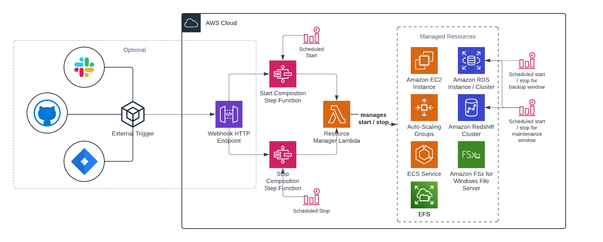

# Resource Scheduler

This composition scheduler can be used to schedule compositions with components that can be temporarily stopped, like EC2 instances, RDS instances/clusters and Redshift clusters. It's aimed at:

* Environments that only run during office hours
* Environments that only run on-demand

It has the following high level architecture:

## Features

### Supported resource types

The following resoure types can be controlled via this scheduler:

* EC2 Auto-Scaling Groups
* ECS Services
* RDS Clusters
* RDS Instances
* Redshift Clusters

RDS only support stopping instances / clusters that are not running in multi-AZ mode.

### Timezone aware

Schedules are timezone aware so there's no need to change them on any DST changes, keeping https://docs.aws.amazon.com/scheduler/latest/UserGuide/schedule-types.html#daylist-savings-time in mind.

### Control order and wait times

The order in which resources are started- and stopped is controllable. These operations are asynchronous and wait times between activities are configurable.

The stop procedure of a schedule is the reverse of the start procedure.

### Respecting maintenance- and backup windows

When setting up scheduling, the scheduler will check if configured maintenance- and backup windows on RDS instances / clusters and Redshift clusters overlap with the scheduled start- and stop times of a composition. If they don't, an additional schedule will be setup to make sure the cluster is started during the scheduled maintenance- and backup windows.

### Webhooks

Optionally a pair of webhooks can be deployed to trigger starting or stopping an environments based on external events. This allows for on-demand starting or stopping of environments by - for example - a service management ticket, a Slack integration, a custom frontend, a Github workflow, etc.

Webhooks require an API key and can be setup to only allow certain IP addresses.

## Limitations

### Schedule mixing

Most of the supported services allow for their own methods of scheduling, either with or without timezone support. This module can not detect existing schedules so overlapping schedules could contradict each other, resulting in unexpected behaviour.

### RDS snapshot retention

When an RDS instance is stopped, the stopped time does not count towards the retention time of snapshots. Effectively this means that any snapshot will be retained longer than expected, including any associated cost.

This behaviour is described here: https://docs.aws.amazon.com/AmazonRDS/latest/UserGuide/USER_ManagingAutomatedBackups.html

### AWS Backup integration

For AWS Backup to be able to create a backup of an RDS instance, it needs to be running. This module is currently not capable of automatically detecting the schedule of any AWS Backup plans. In such cases you will need to manually align the schedules.

## Setup

To setup this module requires a composition of the resources that need to be managed. Based on that input, a state machine is generated.

Please see the [examples](examples/) folder for code examples of how to implement this module.

## Development

This module uses the integrated Lambda to abstract some of the more complex functionality away. For redistribution purposes, the following dependencies have been vendorized:

* pyawscron 1.0.6: https://pypi.org/project/pyawscron/ - https://github.com/pitchblack408/pyawscron/tree/1.0.6
